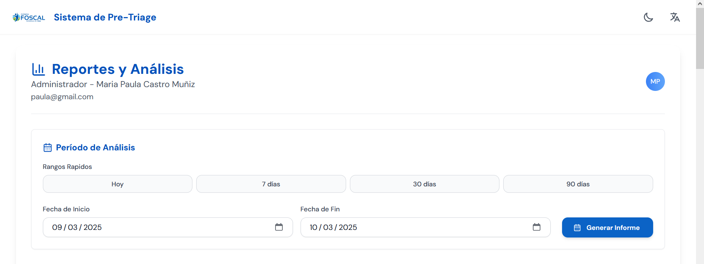
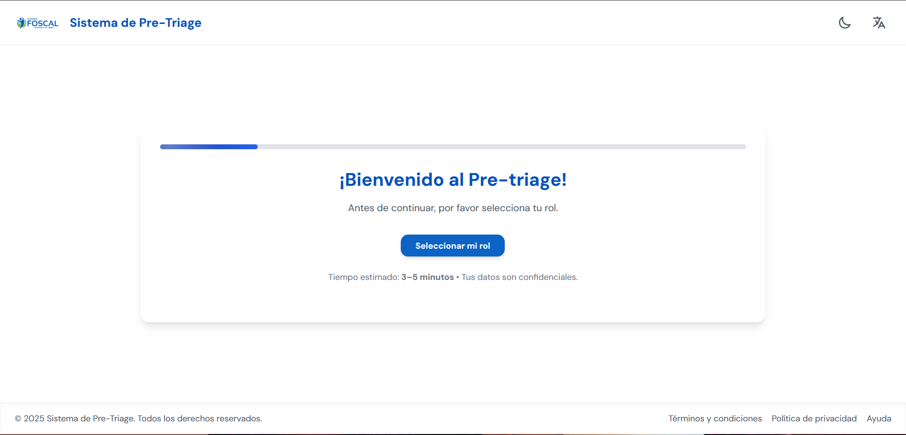

# Sistema de Triage Médico

Un sistema integral de clasificación médica basado en el Emergency Severity Index (ESI) para optimizar la atención en servicios de urgencias hospitalarias.

## Descripción General

El Sistema de Triage Médico es una aplicación web completa que automatiza el proceso de clasificación de pacientes en servicios de urgencias mediante el protocolo ESI (Emergency Severity Index). El sistema permite evaluar de manera sistemática y objetiva la gravedad de los pacientes, asignando niveles de prioridad del 1 al 5, donde 1 representa la máxima urgencia y 5 la menor.

## Arquitectura del Sistema

### Backend
- **Framework**: Django 5.2.6 con Django REST Framework
- **Lenguaje**: Python 3.13
- **Base de Datos**: SQLite (desarrollo) / MySQL/PostgreSQL (producción)
- **Autenticación**: JWT (JSON Web Tokens)
- **API**: RESTful con versionado

### Frontend
- **Framework**: React.js 18.2.0
- **Enrutamiento**: React Router DOM 7.8.2
- **Estilos**: Tailwind CSS
- **Gráficos**: Chart.js con React-ChartJS-2
- **Iconos**: Lucide React
- **HTTP Client**: Axios

### Funcionalidades Principales

#### Gestión de Usuarios
- **Autenticación segura** con JWT
- **Roles diferenciados**: Administrador y Personal estándar
- **Gestión completa** de usuarios del sistema


#### Registro de Pacientes
- **Información demográfica completa**: datos personales, contacto y seguridad social
- **Contactos de emergencia**: registro de familiares o allegados
- **Síntomas iniciales**: descripción de la condición del paciente
- **Validación de datos** en tiempo real


#### Sistema de Triage Inteligente
- **Cuestionario dinámico** basado en algoritmos médicos
- **Clasificación ESI automática** (niveles 1-5)
- **Flujos específicos** para:
  - Mujeres embarazadas
  - Adultos mayores (>65 años)
  - Enfermedades crónicas (HTA, EPOC, Enfermedad Coronaria)
  - Alergias y reacciones
- **Evaluación de signos vitales** y síntomas críticos

#### Dashboard Administrativo
- **Vista general** del estado del sistema
- **Métricas en tiempo real** de pacientes y clasificaciones
- **Gestión de usuarios** y permisos
- **Monitoreo de actividad** del sistema


#### Sistema de Reportes Avanzados
- **Distribución de niveles ESI** con gráficos interactivos
- **Tendencias temporales** de atenciones médicas
- **Métricas de rendimiento** del servicio de urgencias
- **Análisis demográfico** de pacientes
- **Reportes de productividad** por períodos
- **Exportación de datos** para análisis externos




#### Pantalla de Bienvenida
- **Interfaz intuitiva** para selección de funcionalidades
- **Acceso rápido** a las principales características
- **Diseño responsivo** adaptable a diferentes dispositivos



## Algoritmo de Triage ESI

El sistema implementa el Emergency Severity Index con las siguientes características:

### Niveles de Clasificación
- **ESI 1** (Rojo): Resucitación - Atención inmediata
- **ESI 2** (Naranja): Emergencia - Atención en 10 minutos
- **ESI 3** (Amarillo): Urgencia - Atención en 30 minutos
- **ESI 4** (Verde): Menos urgente - Atención en 1-2 horas
- **ESI 5** (Azul): No urgente - Atención rutinaria

### Criterios de Evaluación
- **Signos vitales críticos**: evaluación automática de parámetros
- **Síntomas de alarma**: identificación de condiciones graves
- **Factores de riesgo**: edad, embarazo, comorbilidades
- **Presentación clínica**: análisis integral de síntomas

### Flujos Especializados
- **Embarazo**: evaluación específica por trimestre
- **Geriatría**: consideraciones para adultos mayores
- **Enfermedades crónicas**: algoritmos adaptados
- **Pediatría**: protocolos diferenciados (en desarrollo)

## Estructura del Proyecto

```
Proyecto-Triage/
├── BackEnd/                    # API Django
│   ├── autenticacion/         # Gestión de usuarios y autenticación
│   ├── pacientes/             # Modelo y servicios de pacientes
│   ├── triage/                # Lógica del sistema de triage
│   │   └── utils/             # Algoritmos y utilidades ESI
│   ├── reportes/              # Generación de reportes y métricas
│   ├── utils/                 # Utilidades compartidas
│   └── scripts/               # Scripts de desarrollo y producción
├── FrontEnd/                  # Aplicación React
│   ├── src/
│   │   ├── components/        # Componentes reutilizables
│   │   ├── pages/             # Páginas de la aplicación
│   │   ├── services/          # Servicios API y utilidades
│   │   ├── contexts/          # Context API de React
│   │   └── hooks/             # Custom hooks
│   └── build/                 # Build de producción
└── images/                    # Capturas de pantalla
```

## Requisitos del Sistema

### Backend
- Python 3.13+
- Django 5.2.6
- Django REST Framework 3.16.1
- Base de datos: SQLite/MySQL/PostgreSQL

### Frontend
- Node.js 16+
- npm o yarn
- React 18.2.0
- Navegadores modernos (Chrome, Firefox, Safari, Edge)

## Instalación y Configuración

### 1. Clonar el Repositorio
```bash
git clone https://github.com/tu-usuario/Proyecto-Triage.git
cd Proyecto-Triage
```

### 2. Configuración del Backend

#### Crear entorno virtual
```bash
cd BackEnd
python -m venv venv

# Windows
venv\\Scripts\\activate

# Linux/Mac
source venv/bin/activate
```

#### Instalar dependencias
```bash
pip install -r requirements.txt
```

#### Configurar variables de entorno
```bash
# Copiar archivo de ejemplo
cp .env.example .env

# Editar .env con tus configuraciones
```

#### Ejecutar migraciones
```bash
python manage.py migrate
```

#### Crear superusuario
```bash
python manage.py createsuperuser
```

#### Iniciar servidor de desarrollo
```bash
python manage.py runserver 8000
```

### 3. Configuración del Frontend

#### Instalar dependencias
```bash
cd FrontEnd
npm install
```

#### Configurar variables de entorno
```bash
# Copiar archivo de ejemplo
cp .env.example .env

# Editar .env con las URLs del backend
```

#### Iniciar servidor de desarrollo
```bash
npm start
```

## Variables de Entorno

### Backend (.env)
```bash
# Seguridad
SECRET_KEY=your-secret-key-here
DEBUG=True

# Base de datos
DB_ENGINE=django.db.backends.sqlite3
DB_NAME=db.sqlite3

# Hosts permitidos
ALLOWED_HOSTS=localhost,127.0.0.1

# CORS
CORS_ALLOWED_ORIGINS=http://localhost:3000
```

### Frontend (.env)
```bash
# API del backend
REACT_APP_API_BASE_URL=http://localhost:8000/api/v1
REACT_APP_BACKEND_URL=http://localhost:8000

# Configuración de desarrollo
PORT=3000
PUBLIC_URL=/
```

## Comandos de Desarrollo

### Backend
```bash
# Ejecutar tests
python manage.py test

# Crear migraciones
python manage.py makemigrations

# Aplicar migraciones
python manage.py migrate

# Recopilar archivos estáticos
python manage.py collectstatic

# Generar datos de prueba
python manage.py shell < scripts/development/generar_pacientes_completos.py
```

### Frontend
```bash
# Desarrollo
npm start

# Build de producción
npm run build

# Ejecutar tests
npm test

# Análisis del bundle
npm run analyze
```

## Deployment

### Backend (Render/Railway/Heroku)
1. Configurar variables de entorno en el servicio
2. Usar `build.sh` para el proceso de build
3. Configurar base de datos PostgreSQL
4. Ejecutar migraciones en producción

### Frontend (Vercel/Netlify)
1. Conectar repositorio
2. Configurar variables de entorno
3. Build automático desde `main` branch
4. Configurar redirects para SPA

## API Endpoints

### Autenticación
- `POST /api/v1/auth/login/` - Iniciar sesión
- `POST /api/v1/auth/refresh/` - Renovar token
- `POST /api/v1/auth/logout/` - Cerrar sesión

### Pacientes
- `GET /api/v1/pacientes/` - Listar pacientes
- `POST /api/v1/pacientes/` - Crear paciente
- `GET /api/v1/pacientes/{id}/` - Detalle de paciente
- `PUT /api/v1/pacientes/{id}/` - Actualizar paciente

### Triage
- `POST /api/v1/triage/sesiones/` - Iniciar sesión de triage
- `POST /api/v1/triage/respuestas/` - Enviar respuesta
- `GET /api/v1/triage/sesiones/{id}/` - Detalle de sesión

### Reportes
- `GET /api/v1/reportes/dashboard/` - Métricas del dashboard
- `GET /api/v1/reportes/distribucion-esi/` - Distribución de niveles ESI
- `GET /api/v1/reportes/tendencias/` - Tendencias temporales

## Contribución

### Guidelines de Desarrollo
1. **Código limpio**: Seguir PEP 8 (Python) y estándares de React
2. **Componentes reutilizables**: Extraer lógica común
3. **Documentación**: Comentar código complejo
4. **Tests**: Incluir tests para nueva funcionalidad
5. **Commits**: Mensajes descriptivos y frecuentes

### Proceso de Contribución
1. Fork del repositorio
2. Crear rama feature: `git checkout -b feature/nueva-funcionalidad`
3. Realizar cambios y tests
4. Commit: `git commit -m "Descripción del cambio"`
5. Push: `git push origin feature/nueva-funcionalidad`
6. Crear Pull Request

## Licencia

Este proyecto fue desarrollado como **Proyecto de Grado** en la Universidad Autónoma de Bucaramanga (UNAB). Los derechos de propiedad intelectual pertenecen a la Universidad Autónoma de Bucaramanga conforme a la normativa institucional vigente.

**Uso permitido**: Revisión académica, evaluación e investigación no comercial.  
**Restricciones**: Uso comercial y redistribución requieren autorización expresa de la UNAB.

Ver el archivo `LICENSE.md` para términos completos y condiciones de uso.

## Soporte y Contacto

Para soporte técnico, reporte de bugs o sugerencias:
- **Issues**: [GitHub Issues](https://github.com/tu-usuario/Proyecto-Triage/issues)
- **Documentación**: [Wiki del proyecto](https://github.com/tu-usuario/Proyecto-Triage/wiki)

## Agradecimientos

- **Emergency Severity Index**: Implementación basada en protocolos médicos estándar
- **Comunidad médica**: Por la validación de algoritmos de triage
- **Contribuidores**: Todos los desarrolladores que han participado en el proyecto

---

**Versión**: 0.1.1  
**Última actualización**: Octubre 2025  
**Estado**: En desarrollo activo